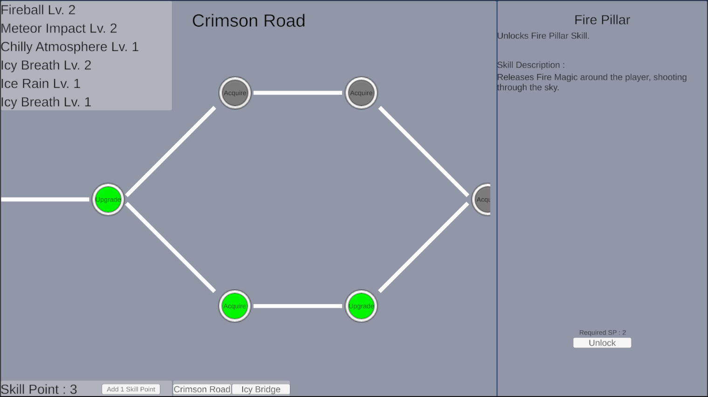

# Skill Tree 1 - Unlock Type

This Skill Tree is used where nodes are unlocked one after each other. Every node can have different effects on player, such as Acquiring Skill, Upgrading Skill, or even Deleting Skill.

The scope of this system is only on the data representation and system architecture of a Skill Tree, which can be found in `Scripts/Core`.

An example of this system where a skill tree is used to unlock and upgrade skills of different elements with skill points is provided in `Scenes/ExampleScene.unity` and `Scripts/Example`.

Please navigate to the respective `Core` and `Example` folder for further documentation on the system.