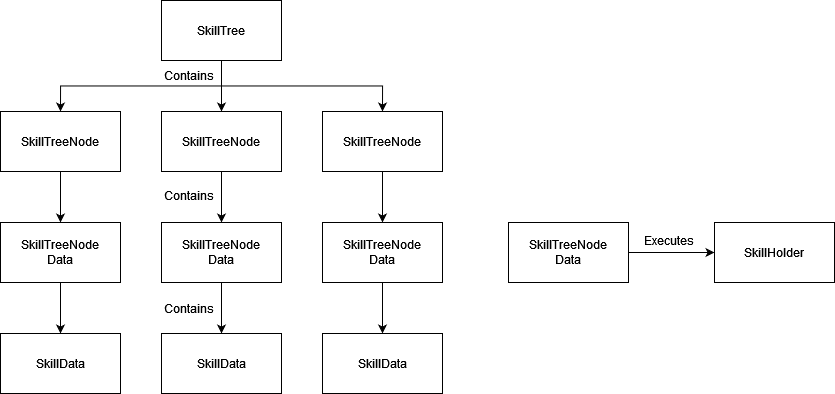

# System Documentation

## SkillTree
The `SkillTree` component represents an individual skill tree containing multiple `SkillTreeNode`. `SkillTree` is intended to be used on the container of skill tree (such as prefab) with the tree UI (nodes, lines, backgrounds, etc) itself already implemented inside. An example of this can be found in `Prefabs/SkillTrees`.

External components will supply SkillTree with the needed function to check a node's unlocked state through `Func<SkillTreeNodeData, bool> CheckNodeUnlocked` and also what happens when a node is clicked through `Action<SkillTreeNode> OnClickNode`.

## SkillTreeNode
The `SkillTreeNode` component represents a single node in a `SkillTree` containing a `SkillTreeNodeData` and (if any) the required `SkillTreeNode` to unlock the node. This component is intended to be used as the container for a Node Data and its visual representation in the Skill Tree. `SkillTree` will supply the node's unlocked state and the node will show the state accordingly.

## SkillTreeNodeData
`SkillTreeNodeData` is a `ScriptableObject` containing basic information for a node (name, description, related skill, required SP) and also how the node affects Player's skill. This script is meant to be overidden to implement the different functionalities of a node. An example of this overiding can be found in `Scripts/Example/TreeNodes`.

This component needs its `SkillData`, which is only a ScriptableObject container of a Skill and can be implemented in any way.

## SkillHolder
The `SkillHolder` components represents Player's Skill Container in the game. In this repository, this component is implemented to be able to save player's acquired skills and their levels, exposing methods to Acquire and Upgrade Skills. This component is intended to be replaced with the implemented Skill Container in your game. However it is implemented, as long as it can be accessed by `SkillTreeNodeData`, the Skill Tree should be able to be used just as well.

# How To Use & Extend
What you need to do to use this system is to implement your own `SkillHolder` component, `SkillData` and `SkillTreeNodeData` ScriptableObject. Your `SkillTreeNodeData` should support your `SkillHolder` and also your `SkillData`. Replacing the code inside `SkillHolder` and `SkillData` is also viable to do, so that you don't need to make a new script.

To extend the system, `SkillTreeNodeData` can be overidden to different types of nodes to fulfil the needs of your system. It can also upgrade player's stats or give a skill a certain attribute (e.g upgrading only the speed of a skill), all depending on your implementation of `SkillHolder`.