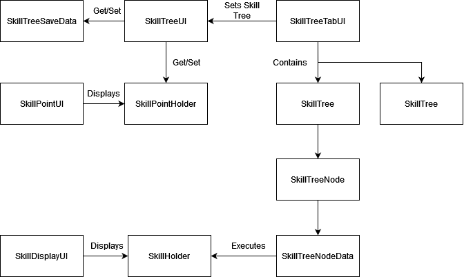

# Example Documentation

## SkillData/SkillData
This scriptable object represents the container of skill information in this example. It contains only the basic information of an `ID`, `Name`, and `Description`.
## SkillData/SkillDatabase
This component serves as the container for the all SkillData is used in this example. 
## UI/SkillDisplayUI
This component is used to show the player's current acquired skils and their levels from `SkillHolder` to the screen in this example.

 

## TreeNodes/AcquireSkillNodeData
This script extends `SkillTreeNodeData` to execute a skill acquirement on `SkillHolder` essentially unlocking a skill.
## TreeNodes/UpgradeSkillNodeData
This script extends `SkillTreeNodeData` to execute a skill upgrade on `SkillHolder`. User can insert to what level the skill will be upgraded to.

 

## SkillTreeSaveData
This component represents the player's save data container filled with data about the skill tree unlocked nodes. In your game, you should use your game's save system to save and load the tree's saved unlocked state.

 

## SkillPointHolder
This component holds the player's current skill point amount. In your game, you should use your own currency/skill point holder to use for your Skill Tree.
## SkillPointUI
This component shows the player's current skill point amount held in `SkillPointHolder` to the screen.

 

## UI/SkillTreeUI
This component represents the screen that player interacts with to use the Skill Tree. In this example, this component loads the saved data from `SkillTreeSaveData` and initializes `SkillTree` with the saved unlocked state. It also shows the information of currently active node and determine if the node can be unlocked based on its required nodes and player's current Skill Point. Lastly it will update the `SkillTreeSaveData` if a node is unlocked.

In your game, you should implement your own UI based on your interaction.

## UI/SkillTreeTabUI
This component controls the tabs containing different skill trees in this example. Upon clicking on a tab, it will set `SkillTreeUI` to activate the corresponding `SkillTree`. The interaction onward will be on the selected Skill Tree.
